Appliquer tous les manifestations-ses et s’assurer que ls pods on bien démarré

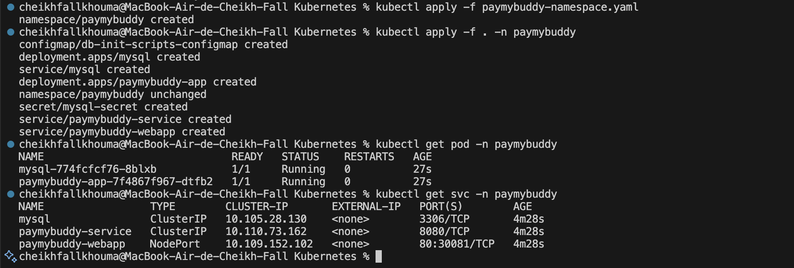

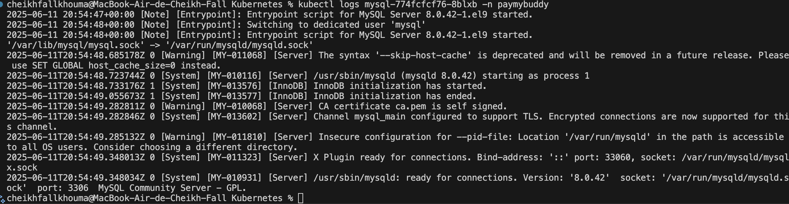

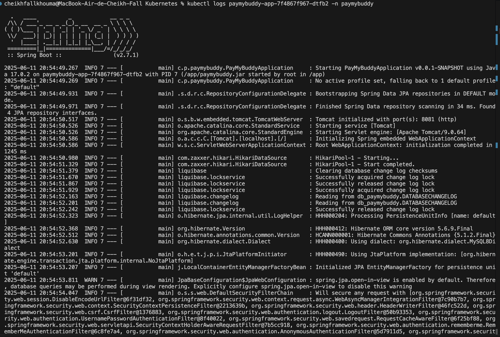

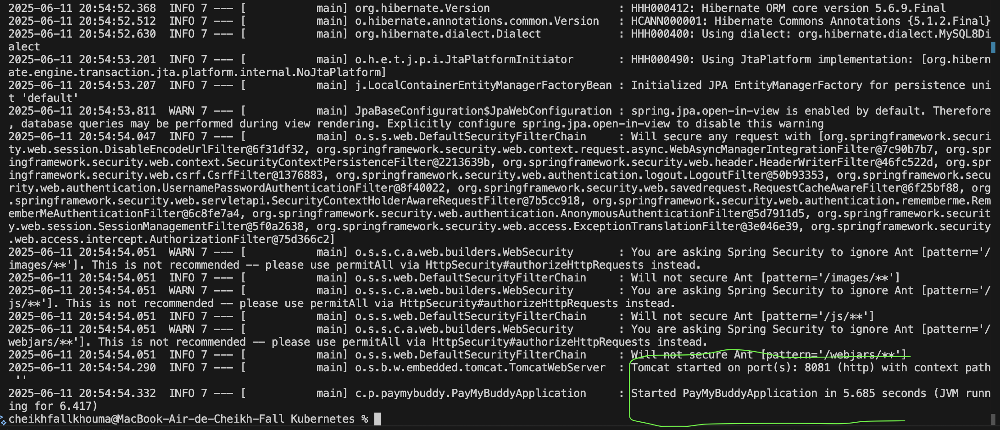

Je vais créer un tunnel pour exposer mon service paymybuddy-webapp
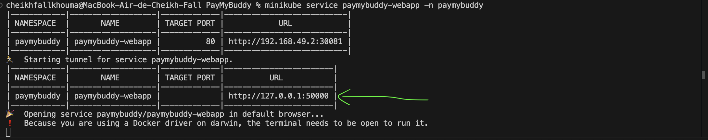

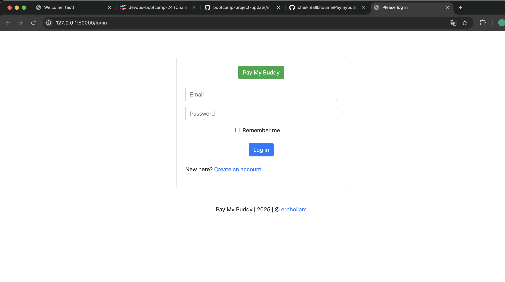

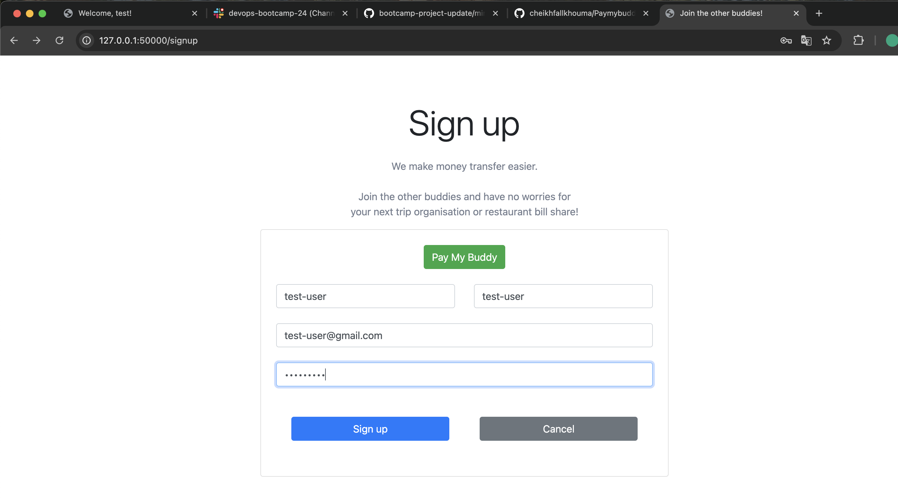

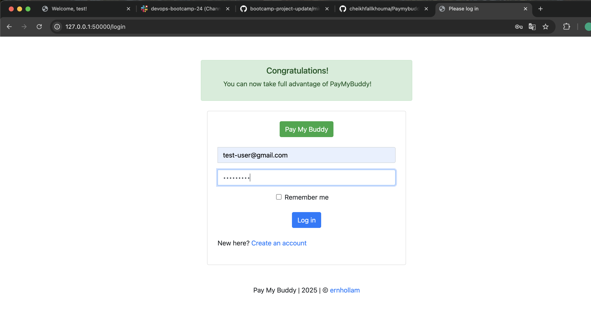

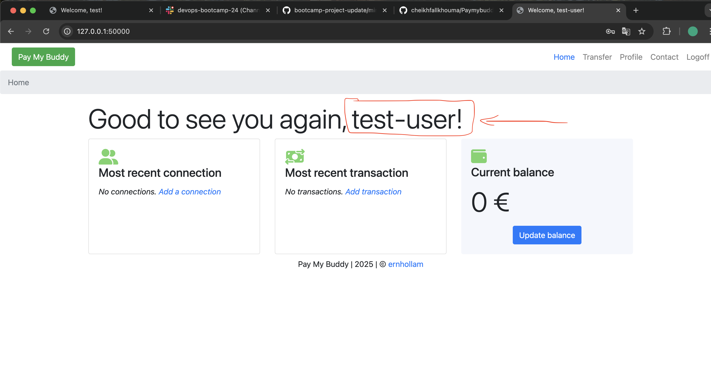

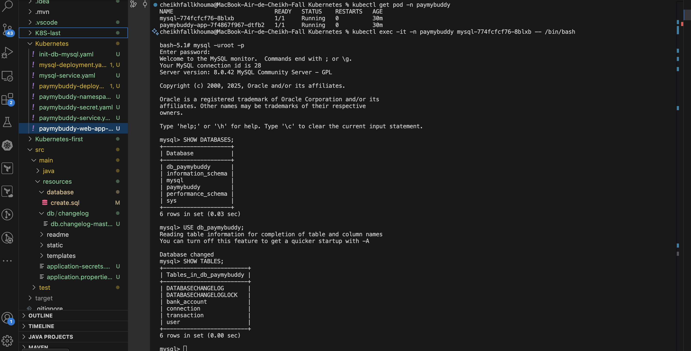

Pour vérifier que le user a été bien créé
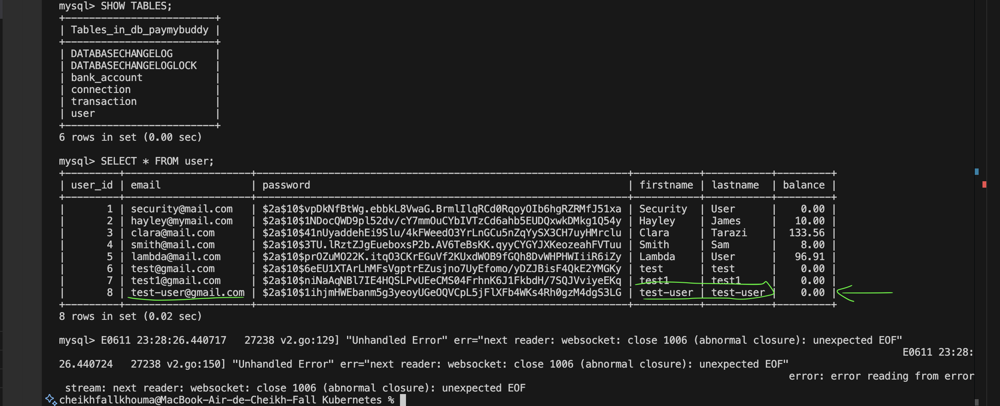

Pour  vérifier que le deployment devra stocker les données PayMyBuddy sur un volme mounté dans le /data de votre nœud
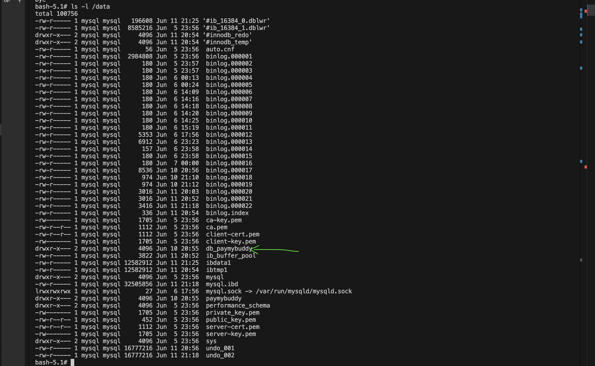